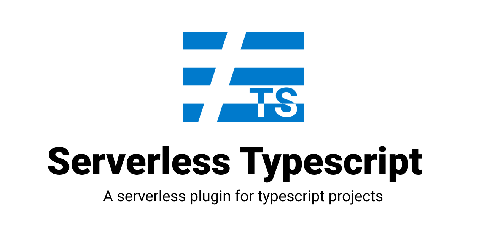

[![Serverless][ico-serverless]][link-serverless]

A Serverless plugin improving typescript developer experience.
Lambda related configuration should be as close as possible from actually executed source code.
Target typical lambda structure :

```ts
import { Event, parseBody } from 'serverless-typescript/lib/api/input-validation';

interface MyHTTPBody {
  param1: string;
  param2: number;
}

/*
 * @Security({'custom:role': Role.Superadmin})
 * @Path('GET', '/api/{myParam}/list')
 */
export const main = async (event: Event<MyHTTPBody>): Promise<APIGatewayProxyResult> => {
  const input = parseBody(event);
  console.log(input.param1);
  //...
};
```

## Highlights

* [[AWS] API Gateway HTTP input validation based on typescript interfaces](./docs/input-validation.md)
* [AWS] API Gateway routing from annotation
* [AWS] Cognito custom attributes checking on request

## Install

```bash
$ npm install serverless-typescript --save-dev
```

Add the plugin to your `serverless.yml` file:

```yaml
plugins:
  - serverless-typescript
```

[ico-serverless]: http://public.serverless.com/badges/v3.svg

[link-serverless]: http://www.serverless.com/
